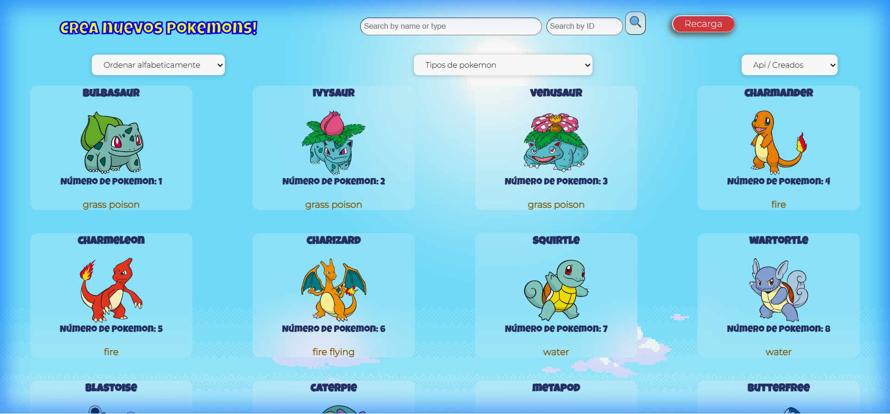
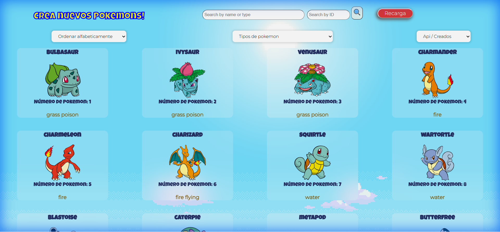

# PI-Pokemon - Single Page Application

    
    
    
    
    
    

# 🚀 Live Demo / Deploy

**[👉 VISITAR APP / VISIT APP](https://pi-pokemon-brown.vercel.app/home)**

---

  <a href="#-english">🇬🇧 ENGLISH</a> | <a href="#-español">🇪🇸 ESPAÑOL</a>

---

## 🇬🇧 ENGLISH

### 📄 Description
This is a full-stack **Single Page Application (SPA)** designed for Pokémon enthusiasts. It consumes data from the [PokeAPI](https://pokeapi.co/) and stores user-created custom Pokémons in a local PostgreSQL database. The app features a robust filtering and sorting system, detail views, and a creation form.

### 📸 Screenshots

#### Landing Page

#### Home Page (Search & Filters)

#### Detail View

#### Create your own Pokemon!

### ✨ Features
*   **Landing Page**: Welcome screen with entry button.
*   **Home Page**:
    *   **Search Bar**: Find Pokémons by name.
    *   **Filtering**: By Type (Fire, Water, etc.) and Origin (API vs Database).
    *   **Sorting**: Alphabetical and by Attack strength.
    *   **Pagination**: Smooth navigation through 12 cards per page.
*   **Detail Page**: ID, Stats (HP, Attack, Defense, Speed), Height, Weight, and Types.
*   **Create Form**: Validate inputs and create custom Pokémons.

### 🛠 Tech Stack
*   **Frontend**: React, Redux, Pure CSS (Modules).
*   **Backend**: Node.js, Express.
*   **Database**: PostgreSQL, Sequelize.
*   **Deployment**: Vercel (Client & API), Neon (Serverless Postgres).

---

## 🇪🇸 ESPAÑOL

### 📄 Descripción
Esta es una **Single Page Application (SPA)** Full Stack temática de Pokémon. Consume datos de la [PokeAPI](https://pokeapi.co/) y permite alojar pokemones propios en una base de datos PostgreSQL. Cuenta con un sistema avanzado de filtrado, ordenamiento y creación.

### 📸 Capturas de Pantalla

#### Landing Page

#### Home Page (Búsqueda y Filtros)

#### Detalle del Pokemon

#### ¡Crea tu propio Pokemon!

### ✨ Funcionalidades
*   **Landing Page**: Pantalla de bienvenida.
*   **Home Page**:
    *   **Buscador**: Encuentra pokemones por nombre.
    *   **Filtros**: Por Tipo y por Origen (Creados vs Existentes).
    *   **Ordenamiento**: Alfabético y por Fuerza de Ataque.
    *   **Paginado**: Navegación fluida.
*   **Detalle**: IDs, Estadísticas completas (Vida, Ataque, Defensa), Peso y Altura.
*   **Formulario de Creación**: Validaciones en tiempo real para crear nuevos pokemones.

### 🛠 Tecnologías
*   **Frontend**: React, Redux, CSS Puro.
*   **Backend**: Node.js, Express.
*   **Base de Datos**: PostgreSQL, Sequelize.
*   **Despliegue**: Vercel (Front & Back), Neon (Base de datos).

---
**Individual Project - Henry Bootcamp**
